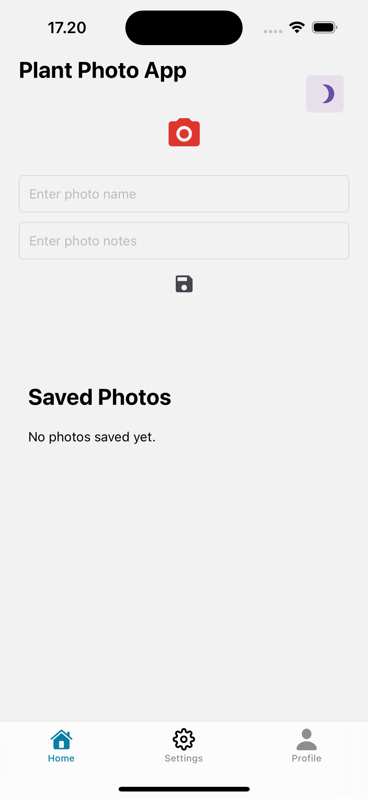

<a name="readme-top"></a>

<!-- PROJECT LOGO -->
<br />
<div align="center">
  <a href="https://github.com/othneildrew/Best-README-Template">
    
  </a>

  <h3 align="center">Plant Photo App</h3>

  <p align="center">
  The **Plant Photo App** allows users to capture, store, and view photos of plants. It features a clean and simple interface for taking plant photos, naming them, and adding optional notes. All photos are saved locally and can be accessed from a list view.

  </p>
</div>


<!-- TABLE OF CONTENTS -->
<details>
  <summary>Table of Contents</summary>
  <ol>
    <li>
      <a href="#about-the-project">About The Project</a>
      <ul>
        <li><a href="#built-with">Built With</a></li>
      </ul>
      <ul>
          <li><a href="#architecture-overview">Architecture Overview</a></li>
         </ul>
    </li>
       <li>
      <a href="#features">Features</a>
      <ul>
    <li>
      <a href="#getting-started">Getting Started</a>
      <ul>
        <li><a href="#prerequisites">Prerequisites</a></li>
        <li><a href="#installation">Installation</a></li>
      </ul>
    </li>
    <li><a href="#usage">Usage</a></li>
    <li><a href="#contributing">Contributing</a></li>
    <li><a href="#contact">Contact</a></li>
  </ol>
</details>


<!-- ABOUT THE PROJECT -->
## About The Project

[](./screenshots/image.png)
[](./screenshots/plant1.png)
[](./screenshots/plant2.png)
[](./screenshots/plant3.png)
The **Plant Photo App** allows users to capture, store, and view photos of plants in the same screen. It features a clean and simple interface for taking plant photos, naming them, and adding optional notes. All photos are saved locally and can be accessed from a list view.
 - first user can take a photo by clicking the camera button. Then use the plant photo and name it. The photo notes is optional then save it by clicking the Save Icon.
 -  List View: View for browsing  plants.
 - clicking the plant photo will take you to the Details view which you can change the name and add notes or change the Image by takin another photo.
 - then there is setting view which is empty and a Profile view also.
 - Above on the right there is Icon to swtich to dark mode and light mode.


<p align="right">(<a href="#readme-top">back to top</a>)</p>


### Built With

## Major Frameworks and Libraries Used

* [](https://reactnative.dev/)
* [](https://reactnavigation.org/)
* [](https://redux-toolkit.js.org/)
* [](https://expo.dev/)
* [](https://callstack.github.io/react-native-paper/)
* [](https://docs.expo.dev/versions/latest/sdk/imagepicker/)

## Architecture Overview
  The app follows a modular architecture, separating concerns into different folders and components:
  components:
  - Screens: Contains main views (List View, Scan View, Details View, Profile, Settings).
  - State Management: Uses Redux Toolkit for managing saved photos and theme mode.
  - Navigation: Uses React Navigation to switch between tabs.
  - Storage: Stores photos locally using Redux state.
  Technical Decisions
  - React Native with Expo: Chosen for fast development and easy deployment.
  - Redux Toolkit: Provides centralized state management for better performance.
  - React Native Paper: Used for UI components to ensure a consistent design.
  - Expo Image Picker: Simplifies photo capture and selection.
  - UUID: Generates unique IDs for saved photos so its easy to update.
  - Dark Mode Support: Implemented using Redux to toggle between themes later if needed theme can be changed in the other screen.
    
## Acknowledgements

* [](https://www.npmjs.com/package/uuid) - For generating unique IDs for photos.
* [](https://github.com/oblador/react-native-vector-icons) - For using icons like camera and save.


[React-Native]: https://reactnative.dev/
[React-Native-url]: https://reactnative.dev/
[React-Navigation]: https://reactnavigation.org/
[React-Navigation-url]: https://reactnavigation.org/
[Redux-Toolkit]: https://redux-toolkit.js.org/
[Redux-Toolkit-url]: https://redux-toolkit.js.org/
[Expo]: https://expo.dev/
[Expo-url]: https://expo.dev/
[React-Native-Paper]: https://callstack.github.io/react-native-paper/
[React-Native-Paper-url]: https://callstack.github.io/react-native-paper/
[Expo-Image-Picker]: https://docs.expo.dev/versions/latest/sdk/imagepicker/
[Expo-Image-Picker-url]: https://docs.expo.dev/versions/latest/sdk/imagepicker/
[UUID]: https://www.npmjs.com/package/uuid
[UUID-url]: https://www.npmjs.com/package/uuid
[React-Native-Vector-Icons]: https://github.com/oblador/react-native-vector-icons
[React-Native-Vector-Icons-url]: https://github.com/oblador/react-native-vector-icons


<p align="right">(<a href="#readme-top">back to top</a>)</p>

## Features

- **Take Photos:** Use the camera to capture plant photos.
- **Save Photos:** Provide a name and optional notes to save photos.
- **List View:** View all saved photos, including their name, date, and notes.
- **Details View:** View certain photo, including their name, and notes and option to edit the name and the notes and change the photo.
- **Theme Toggle:** Switch between dark and light themes.
- **Cross-Platform Support:** Built with Expo for seamless iOS and Android compatibility.


<!-- GETTING STARTED -->
## Getting Started

This is an example of how you may give instructions on setting up your project locally.
To get a local copy up and running follow these simple example steps.

### Prerequisites

This is an example of how to list things you need to use the software and how to install them.
* npm
  ```sh
  npm install npm@latest -g
  ```

### Installation

_Below is an example of how you can instruct your audience on installing and setting up your app. This template doesn't rely on any external dependencies or services._
1. Clone the repository:
   ```bash
   git clone https://github.com/zeriabo/plant-app.git

2. unzip the folder
3. cd plant-app

4. Install dependencies
   ```sh
   yarn install
   ```
5. Start the development server:
    ```sh
   yarn start
   ```
6. Run by IOS or Android:
  
<p align="right">(<a href="#readme-top">back to top</a>)</p>


<!-- USAGE EXAMPLES -->
## Prerequisites
Ensure you have the following installed:

Node.js (version 14 or later)
Yarn (or npm)
Expo CLI

<p align="right">(<a href="#readme-top">back to top</a>)</p>


# Features and Usage
- Theme Toggle
- The app supports both dark and light themes. The theme can be switched via an icon button at the top of the screen.
- Taking and Saving Photos
- Tap the camera icon to take a photo of a plant.
- Enter a name for the photo and optional notes.
- Tap the save icon to save the photo along with the name and notes.
- Viewing Photos
- All saved photos are listed below the camera input no need to switch screens.
- Each photo displays its name, date, and an option to navigate to a details page where user can edit the name and the description of the image or change the image itself.

## Folder Structure
```sh
├── app/
│   ├── (tabs)/
│   │   ├── _layout.tsx        # Tab layout and navigation
│   │   ├── index.tsx          # List view of saved photos and adding photos
│   │   └── settings.tsx       # Settings page 
│   │   └── profile.tsx        # Profile page
│   ├── layout.tsx             # Root layout for navigation
    ├── -not/found.tsx         # Not Found page
│   └── details.tsx            # Photo detail page 
├── store/
│   ├── slices/
│   │   ├── photoSlice.ts      # Redux slice for managing photos
│   │   └── themeSlice.ts      # Redux slice for theme management
│   ├── store.ts               # Store configuration
├── assets/
│   └── fonts/                 # Custom fonts 
├── package.json               # Project dependencies
├── yarn.lock                  # Yarn lock file
└── tsconfig.json              # TypeScript configuration
 ```

## Libraries Used
* [![React][React.js]][React-url]


<!-- CONTRIBUTING -->
## Contributing

Contributions are what make the open source community such an amazing place to learn, inspire, and create. Any contributions you make are **greatly appreciated**.

If you have a suggestion that would make this better, please fork the repo and create a pull request. You can also simply open an issue with the tag "enhancement".
Don't forget to give the project a star! Thanks again!

1. Fork the Project
2. Create your Feature Branch (`git checkout -b feature/AmazingFeature`)
3. Commit your Changes (`git commit -m 'Add some AmazingFeature'`)
4. Push to the Branch (`git push origin feature/AmazingFeature`)
5. Open a Pull Request

<p align="right">(<a href="#readme-top">back to top</a>)</p>


<!-- CONTACT -->
## Contact

Zeriab -- zeriab@hotmail.com


<p align="right">(<a href="#readme-top">back to top</a>)</p>


